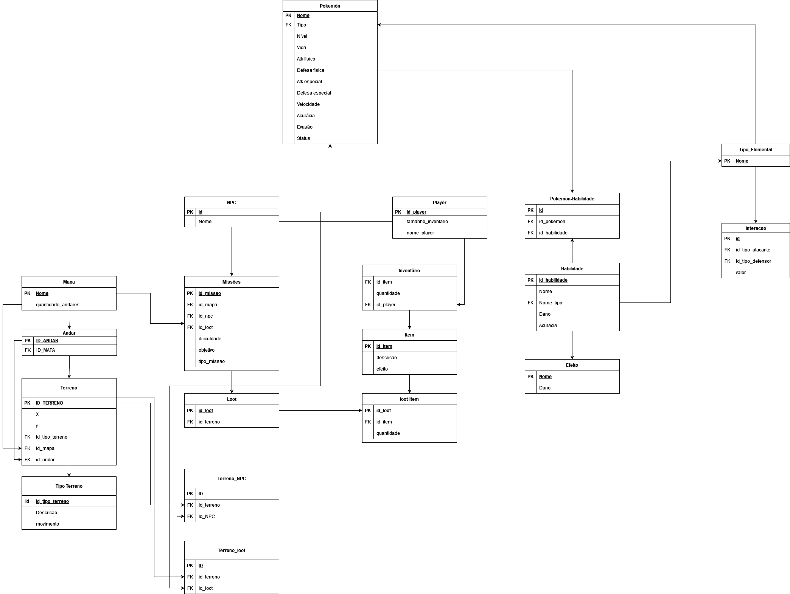

O Diagrama de Entidade-Relacionamento (DER) destaca as principais entidades e seus relacionamentos. Esse diagrama organizacional ilustra as informações que fundamenta o funcionamento do jogo, detalhando a estrutura de dados essencial para o desenvolvimento.

Abaixo temos a imagem do diagrama de entidade relacionamento:

## Histórico de Versão

| Versão |    Data    |                     Descrição                     |                                                 Autor(es)                                                  |
| :----: | :--------: | :-----------------------------------------------: | :--------------------------------------------------------------------------------------------------------: |
| `1.0`  | 22/04/2024 | Primeira versão do modelo entidade relacionanemto | [Gabriel Marcolino](https://github.com/GabrielMR360) e [Shaíne Oliveira](ttps://github.com/ShaineOliveira) |
| `1.1`  | 27/06/2024 |               Adicionando descrição               | [Gabriel Marcolino](https://github.com/GabrielMR360) e [Shaíne Oliveira](ttps://github.com/ShaineOliveira) |
| `1.2`  | 16/07/2024 |               Atualizando diagrama                | [Gabriel Marcolino](https://github.com/GabrielMR360) e [Shaíne Oliveira](ttps://github.com/ShaineOliveira) |
| `1.3`  | 17/07/2024 |               Atualizando diagrama                | [José Filipi](https://github.com/JoseFilipi)  |
| `1.4`  | 18/07/2024 |               Atualizando diagrama e correção de relacionameto             | [Leonardo Bonetti](https://github.com/LeoFacB)  |
