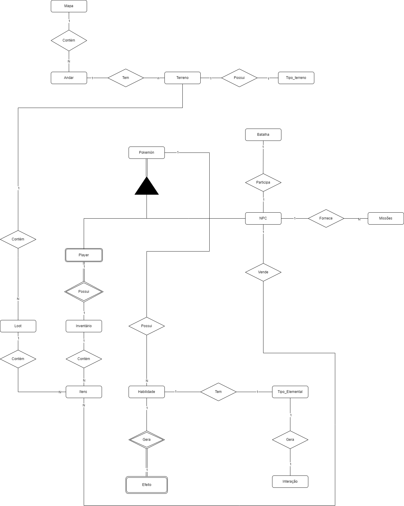

O Modelo Entidade-Relacionamento (ER) organiza os dados essenciais em diversas tabelas inter-relacionadas, cada uma com atributos específicos e chaves para definir as relações entre elas.

Abaixo temos a imagem do modelo de entidade relacionamento:

[Link para o Modelo Entidade-Relacionamento]()

## Histórico de Versão

| Versão |    Data    |                     Descrição                     |                                                                                                Autor(es)                                                                                                 |
| :----: | :--------: | :-----------------------------------------------: | :------------------------------------------------------------------------------------------------------------------------------------------------------------------------------------------------------: |
| `1.0`  | 27/06/2024 | Primeira versão do modelo entidade relacionanemto | [Gabriel Marcolino](https://github.com/GabrielMR360), [Shaíne Oliveira](ttps://github.com/ShaineOliveira), [José Filipi](https://github.com/JoseFilipi) e [Leonardo Bonetti](https://github.com/LeoFacB) |
| `1.1`  | 27/06/2024 |                  Atualizando MER                  |                                                [Gabriel Marcolino](https://github.com/GabrielMR360) e [Shaíne Oliveira](ttps://github.com/ShaineOliveira)                                                 |
